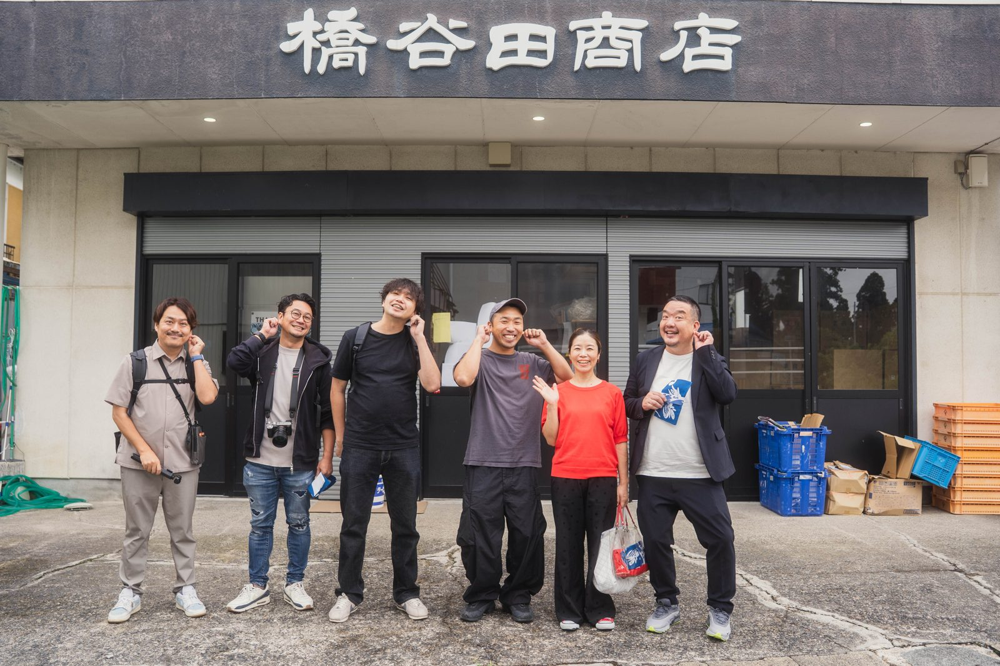
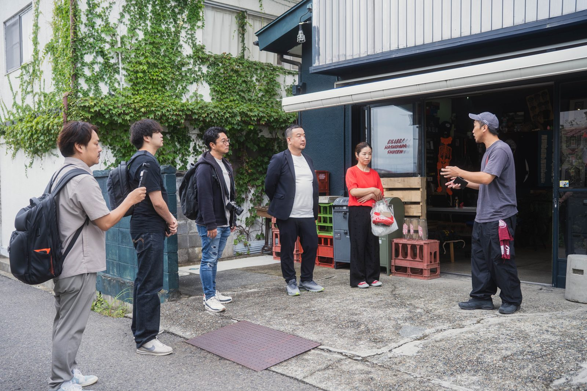
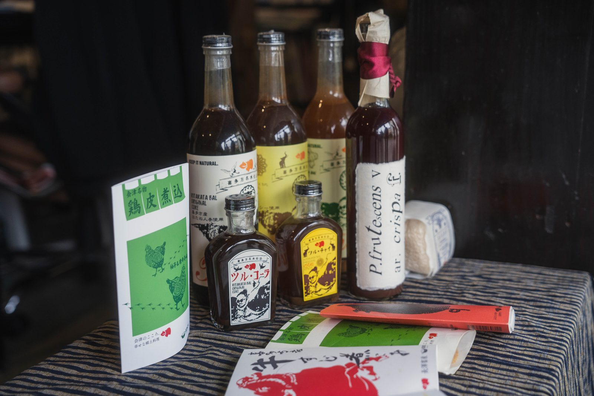
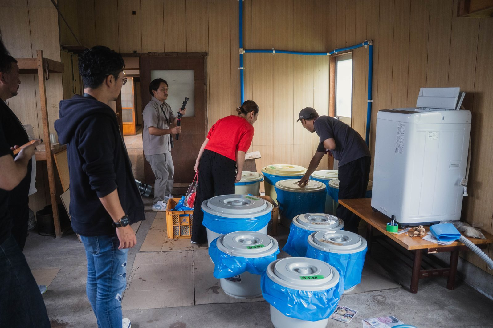
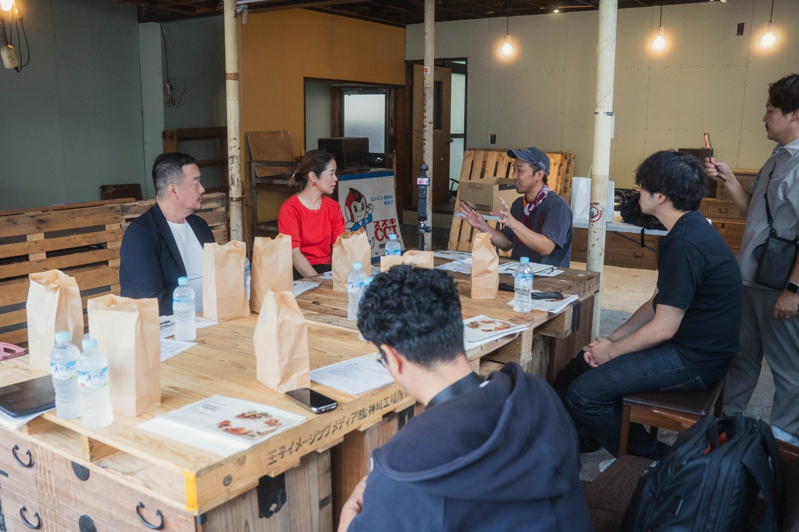
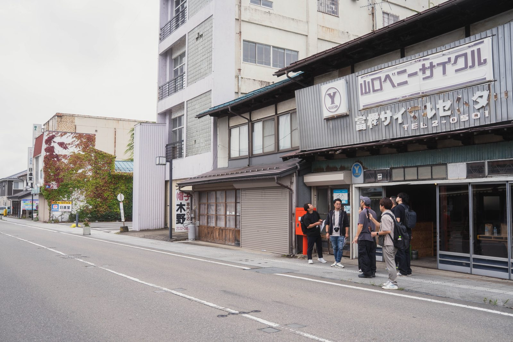

# 地域交流レポート

**令和8年度 ふくしま×企業 地域共創・関係人口創出事業**

*橋谷田商店本店前にて。左からTTC五十嵐、Dプランメンバー、橋谷田周平さん*

## 基本情報

| 項目 | 内容 |
| --- | --- |
| 実施日 | 2026年9月15日(火) |
| アテンド担当 | TTC 五十嵐 |
| 訪問企業 | 株式会社Dプラン(5名／内藤さん 他) |
| 受入企業 | 株式会社橋谷田商店(代表取締役 橋谷田周平さん) |
| 交流場所 | 橋谷田商店(〒966-0896 福島県喜多方市字諏訪160-9) |

## 選定理由

Dプランは食の廃棄問題や未利用食材の活用方法に関心を持ち、独自の「キムチ化」技術で規格外野菜・傷物・ご当地食材を商品化している。橋谷田商店も地域の未利用資源・未利用食材の活用に取り組んでおり、加工技術と販路の拡大を求めていたことから、双方の強みが重なる組み合わせとして本交流が実現した。

*橋谷田さんから店舗の取り組みについて説明を受けるDプランの皆さんとTTC五十嵐*

## 参加者

**株式会社Dプラン**
- 内藤さん(キムチ化事業の発案者、元・懐石料理の板前)
- 田中さん(内藤さんのパートナー、和食文化の継承と発信を担当)
- 他3名

**株式会社橋谷田商店**
- 橋谷田周平さん(代表取締役)

**アテンド**
- TTC 五十嵐(福島県コーディネーター)

## 本レポートの軸

今回の交流では、①**キムチを活用した商品化のアイディア**、②**柿渋・空き家・食材等の未利用資源を活用した体験コンテンツのアイディア**という2つの軸で具体的な意見交換が行われた。以下、それぞれの内容を整理する。

---

## ① キムチを活用した商品化のアイディア

*「つるコーラ」「つるチャイ」や「鶏皮(鶏モツ)煮込み」など、橋谷田商店の看板商品*

橋谷田商店が持つ食品加工・未利用食材の活用ノウハウと、Dプランの「全国キムチ化計画」(規格外野菜・傷物・ご当地食材を幅広くキムチ化するモデル)を掛け合わせた商品開発について、具体的なアイデアが多数出された。

- **桃のキムチ化**:訪問時期がちょうど福島県産桃の最盛期と重なっていたことから、桃を使ったキムチベース商品の試作を提案。橋谷田商店のレトルト加工技術と組み合わせた常温商品化の可能性について合意。
- **喜多方の発酵文化を活かしたオリジナルキムチジャン**:醤油の産地であり醸造文化が根付く喜多方の特性を活かし、醤油ベースのキムチジャンを共同開発するアイデア。
- **キムチラーメン構想**:喜多方ラーメン(醤油スープ)との相性を活かし、「キムチラーメン」やラーメンに合う専用キムチを商品化する案。
- **鶏モツ・牛すじ煮込みとのコラボレーション**:橋谷田商店が持つ未利用食材の加工技術(鶏モツ・牛すじのレトルト加工)とDプランのキムチ化技術を組み合わせた新商品の可能性。Dプランが他地域で手がけた金目鯛キムチ(伊豆稲取・味噌漬け文化とのコラボ)や親鳥キムチ(殺処分予定だった親鳥の有効活用)などの先行事例を参考に検討。
- **地域食材キムチシリーズへの展開**:Dプランが全国で展開する「規格外食材キムチ化」モデル(梨・バナナ・きのこ等)を、福島県内の農産物(アスパラ、いちご等)や橋谷田商店の農家ネットワークに応用する提案。
- **伴走型の地域内製造モデル**:Dプランがキムチの素を橋谷田商店に卸し、現地でのキムチ製造・販売を段階的に立ち上げていく伴走支援モデル(規格外食材のテスト販売→実績提示→技術移転→継続的な素材供給)を、橋谷田商店にも応用できないか意見交換。

## ② 未利用資源(柿渋・空き家・食材等)を活用した体験コンテンツのアイディア

*本店裏の倉庫にて。柿渋の仕込みタンクや古い生活道具が残る空間を見学*

橋谷田商店が抱える「地域の未利用資源をどう活かすか」という課題認識をもとに、体験型コンテンツとしての展開アイデアを議論した。

- **柿渋染め体験**:会津の未利用の柿(見不知柿など)から作る無臭柿渋の特許技術を活かし、会津木綿の織元と連携した染色体験コンテンツとしての展開案。倉庫には仕込み中の柿渋タンクや代々受け継がれてきた古い生活道具が残されており、「価値を再編集していきたい」という橋谷田さんの想いを踏まえた体験設計の可能性を確認。
- **空き家(商店街拠点)を活用した交流・体験スペース**:橋谷田商店が購入した商店街の空き家「キラー橋谷田商店」を、意見交換・食体験・ワークショップの拠点として活用するアイデア。

*商店街の空き家を改装した拠点にて。木製什器のテーブルを囲んで意見交換*

- **キムチ作りワークショップの喜多方版展開**:Dプランが実施している、野菜の切り方・出汁の取り方・塩分濃度の指導などを組み込んだ食育型ワークショップを、橋谷田商店の拠点で企画する案。
- **「キムチの学校」構想**:短期・長期コースで職人を育成する仕組みを喜多方でも展開し、地域の後継者・職人確保につなげるアイデア。
- **喜多方観光の滞在時間延長策**:ラーメン店の行列・待ち時間を活用した街歩きコンテンツや、老舗店舗を巡る「道具」テーマの体験、農家訪問型のキムチ作り体験(Dプランが横浜で実施した事例を参考)など、滞在型コンテンツの企画案。

*橋谷田商店周辺の商店街を散策。老舗の自転車店なども見て回りながら、街歩き・滞在型コンテンツの可能性を議論*

- **古い生活道具・空き家の再編集**:倉庫に残る古い生活道具(火鉢、自転車等)や空き家となった商店街の建物を活用した、昭和レトロな体験・展示コンテンツのアイデア。

## 今後のアクション

- 桃を使ったキムチベースの試作・商品化を進める。
- 柿渋染め体験や「キラー橋谷田商店」を拠点とした体験コンテンツの具体化を検討する。
- 橋谷田商店を起点に、県内の生産者・事業者とDプランのマッチングを継続する。
- Dプランが持つ東北エリアのネットワーク(青森など)を活用した「全国キムチ化計画」東北展開の可能性を検討する。
- 県の6次化・イノベーション支援策の活用を含め、TTC五十嵐が継続してコーディネートを行う。
- 双方の連絡はLINEを中心に継続し、次回訪問時の具体的な連携内容を詰める。

## 所感

橋谷田商店が長年培ってきた未利用資源の活用ノウハウと、Dプランの発酵・キムチ化技術という異なるアプローチが、「地域の資源を無駄なく循環させる」という共通のビジョンのもとで高い親和性を示した交流となった。商品化(キムチ活用)と体験コンテンツ化(未利用資源活用)という2つの軸で具体的なアイデアが多数出たことは、単なる一過性の交流にとどまらない継続的な連携の土台になり得る。次回以降は各アイデアの優先順位付けと試作・実証への落とし込みが鍵となる。
