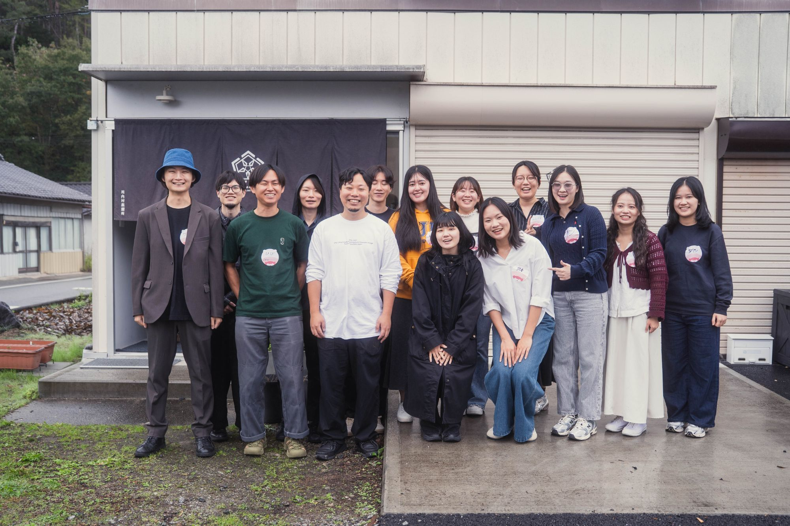
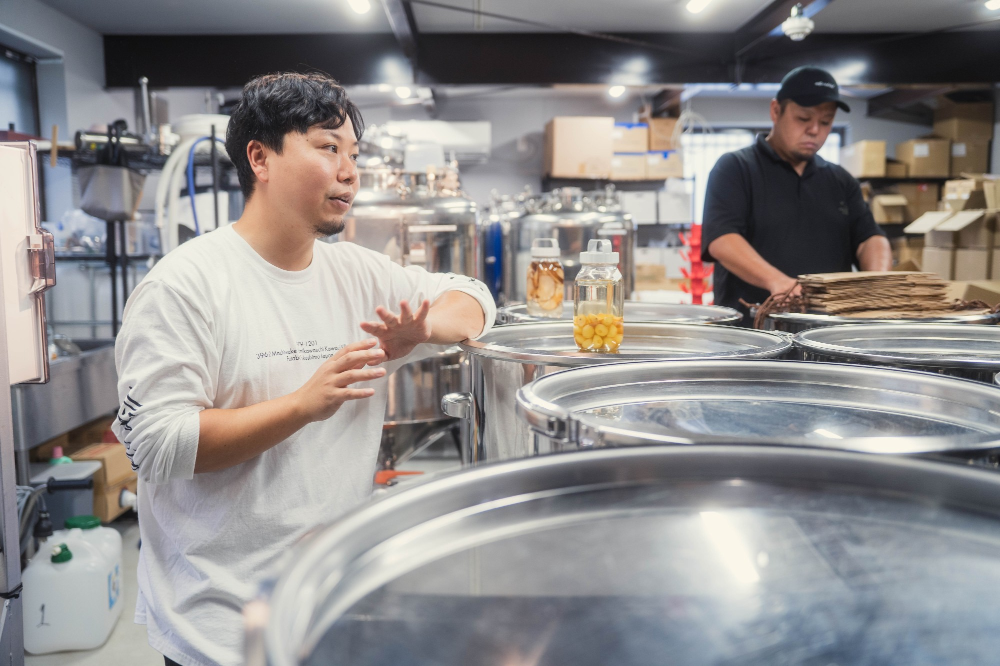
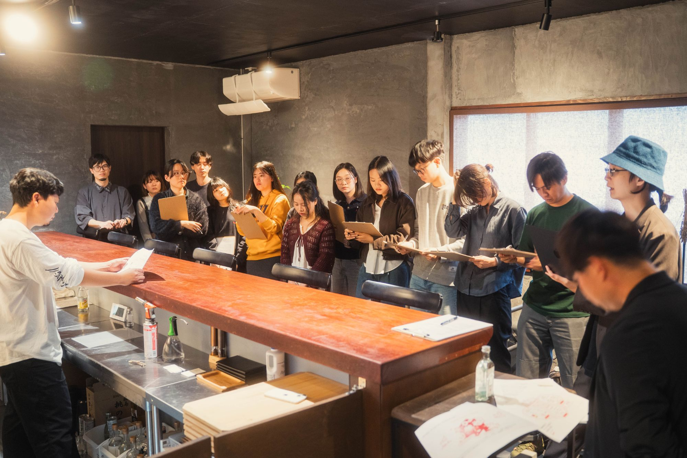
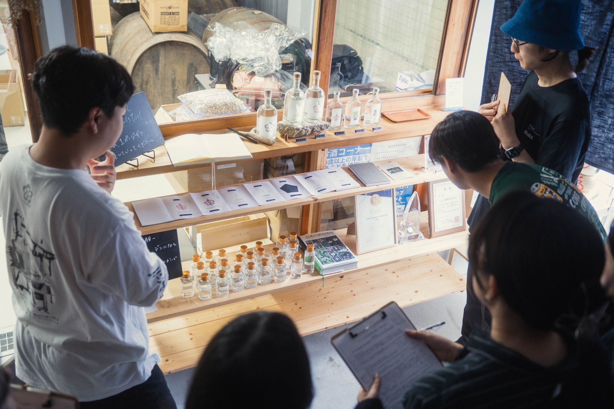
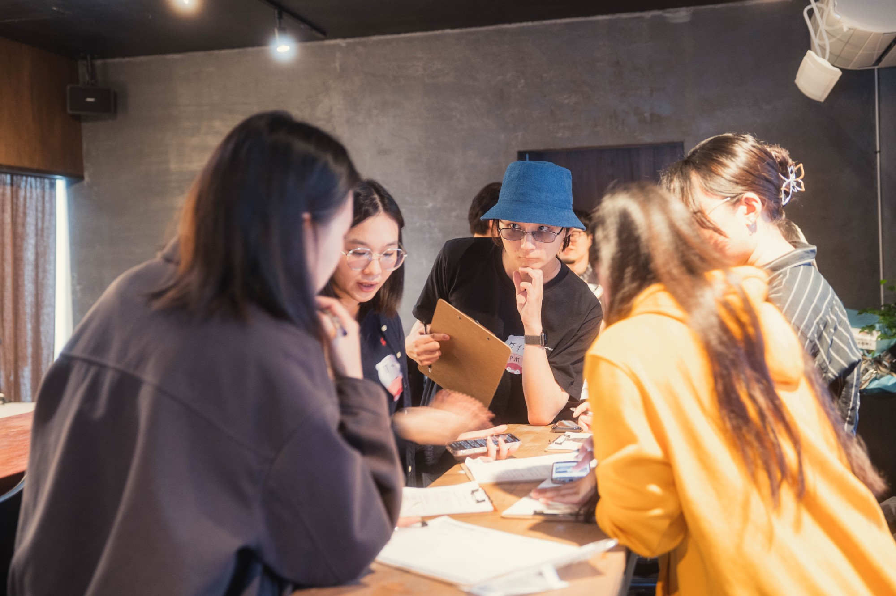

# 地域交流レポート

**令和8年度 ふくしま×企業 地域共創・関係人口創出事業**

*川内村蒸溜所(naturadistill)前にて。株式会社SunAsterisk参加メンバーと大島草太さん(左端)*

> ※本資料に記載の日程は、提供されたアジェンダ・ヒアリングシートの更新時期(2026年9月〜10月)から推定したものであり、実施日の正式な記載は確認できていません。正確な日付が分かり次第、追記してください。

## 基本情報

| 項目 | 内容 |
| --- | --- |
| 実施時期 | 2026年9月頃(資料更新日より推定) |
| 訪問企業 | 株式会社SunAsterisk(PM・デザイナー・テックリード・エンジニア 他) |
| 受入企業 | 株式会社Kokage・naturadistill 川内村蒸溜所(代表取締役 大島草太さん) |
| 交流場所 | 川内村蒸溜所(福島県双葉郡川内村) |
| 交流テーマ | レストラン「oku」と宿泊施設ができた後の「川内村での過ごし方」を一緒に考える |

## 本交流の目的

川内村蒸溜所が取り組む情報発信(ブランディングや海外向け集客等)やデジタルを活用した業務基盤構築に対し、SunAsterisk社が持つ多様な人材・スキルによる知見やアイデアをもとに、課題解決や新たな取組みにつながる意見交換を行うことを目的に実施された。交流後は、SunAsterisk社内でアイデアをとりまとめて資料化し、改めて川内村蒸溜所に共有する予定となっている。

## 参加者

**株式会社SunAsterisk**
- 上田 啓也 氏(PM/プロジェクトマネージャー)
- 日々橋 氏(デザイナー)
- 岸本 氏(テックリード)
- サータオ 氏(エンジニア/VCST・ベトナム開発チーム連携)
- 岩本 氏(エンジニア/Web・アプリ・AIシステム担当)
- 福岡 氏(UI/UXデザイナー)
- 他デザイナー 1名

**株式会社Kokage・naturadistill 川内村蒸溜所**
- 大島 草太 さん(代表取締役)

## 事業紹介:川内村蒸溜所(naturadistill)

*ステンレスタンクが並ぶ製造エリアにて、減圧低温蒸留の技術について解説する大島さん*

- 2024年11月に開所したクラフト蒸溜所。阿武隈高地の地下水と日本固有の植物(ボタニカル)を活かしたクラフトジンを製造している。
- 独自の**減圧低温蒸留(真空蒸留)**技術により、通常78〜100℃で行う蒸留を20〜40℃の低温で実施。花や柑橘など繊細な香りを損なわずに抽出できる点が特徴で、1バッチの完成に約2ヶ月を要する手間のかかる製法を確立している。
- 創業の原点には、代表・大島さんが海外滞在中に経験した風評被害がある。「言葉だけでは届かない壁がある」という気づきから、「世界中で客観的に高く評価されるプロダクトをつくる」ことを事業の軸に据えている。
- ジン製造を核に、レストランバー「oku」、体験型宿泊施設・サウナ、森林再生プロジェクト(赤松の松枯れ対策と植樹によるボタニカル活用)など、多角的な事業展開を進めている。
- 山の資源を採り尽くさないよう生産数に上限を設けており、規模拡大ではなく付加価値と持続性で事業を成り立たせる設計を志向している。

## 事業紹介:株式会社SunAsterisk

「誰もが価値創造に夢中になれる世界」をビジョンに掲げるデジタルクリエイティブスタジオ。日本に加えベトナム3拠点・フィリピン1拠点を展開し、約1,500名規模のエンジニア・デザイナー・PMが所属、これまでに1,000以上の新規事業プロダクトを開発してきた実績を持つ。デザインシンキング・リーンスタートアップ・アジャイル開発を統合したアプローチで、事業戦略立案からサービスデザイン、MVP開発、本開発、保守運用・グロースまでを一貫して支援している。

## 意見交換の内容

*レストランバー「oku」のカウンターにて、資料を手に説明を聞くSunAsteriskメンバー*

### 製造DX・データのデジタル化

- 気温・湿度・圧力、漬け込み日数、カット作業(Head/Heart/Tail)のタイミングなど、現在すべて紙レポートに手書きで記録している製造データについて、シンプルな在庫・製造管理システムへの移行を提案。
- タンク残量の計測に業界伝統の「業調棒」を用いるアナログ手法について、デジタルセンサー(光学・超音波等)導入の可能性を議論。
- 大島さん・スタッフが日常的にAIを活用できるよう、SunAsterisk社が提供する「AI活用ワークショップ」の実施を提案。
- 「職人の手仕事」と「効率化」の調和という視点が共有された。嗜好品であるクラフトジンにおいては人の手をかけること自体が付加価値であり、作り手としての歓びを残すべき部分と、バックオフィスの単純作業など削減すべき負荷を明確に切り分ける重要性が指摘された。

*ショップスペースにて。ジンのボトルや受賞トロフィー、海外展開に関する資料を見ながら意見交換*

### 体験価値の拡張とブランディング

- サウナや宿泊、新しい体験コンテンツの構想に対し、生成AI・画像生成AIを用いて即座にビジュアライズし、カウンターで来店客の反応を直接ヒアリングしながら高速でコンセプト検証を行う手法を提案。
- 現地に来られない海外・遠方の購入者向けに、ボトルとともに「カヤの実」や香りサンプルを同梱して届ける、リアルな体験設計のアイデアが共有された。
- レストラン「oku」と宿泊施設が揃った後の「川内村での過ごし方」をテーマに、ジンをきっかけに再来訪してもらう滞在コンテンツの設計について議論。
- 震災復興の象徴としてではなく、純粋に「お酒」として選んでもらうための発信のあり方について、村外の視点からの意見交換が行われた。

*クリップボードを手に、各テーマについて少人数グループで意見交換する参加者*

## 今後のアクション

| タスク内容 | 担当 |
| --- | --- |
| 手書き製造レポートのデータ化・要件整理 | 川内村蒸溜所 / SunAsterisk開発チーム |
| 現場ヒアリングに基づくDX・システム提案のとりまとめ | 株式会社SunAsterisk |
| 遠方顧客向け体験型梱包(ボタニカルサンプル等)の検討 | 川内村蒸溜所 企画チーム |
| 森林再生プロジェクト×企業研修プログラムの企図・概念化 | 両社協議(中長期) |

## 所感

大島さんからは「前職のクラフトビール会社で、拡大にともない醸造家が単なる工場作業員のようになり、ものづくりの楽しさが失われてしまった経験がある。今回の議論を通じ、作り手の歓びが味に反映されるコアな部分は守りながら、その周辺の不要な作業を削るためにこそDXを活用すべきという視点を再確認できた」との総括コメントがあった。また、森林再生については「すぐに利益を生むものではないが、10年・20年先の未来を見据え、様々なパートナーを巻き込みながら進めていきたい」との長期的な決意も語られた。

製造の効率化という技術的な論点と、「お酒としてどう選ばれるか」というブランディングの論点が同じ場で語られたことで、単なるシステム導入支援にとどまらない、事業の哲学そのものに寄り添った意見交換となった。今後はデータ化の要件整理と体験型コンテンツの試作が、連携の具体化における鍵となる。
